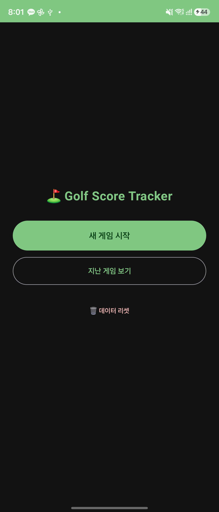
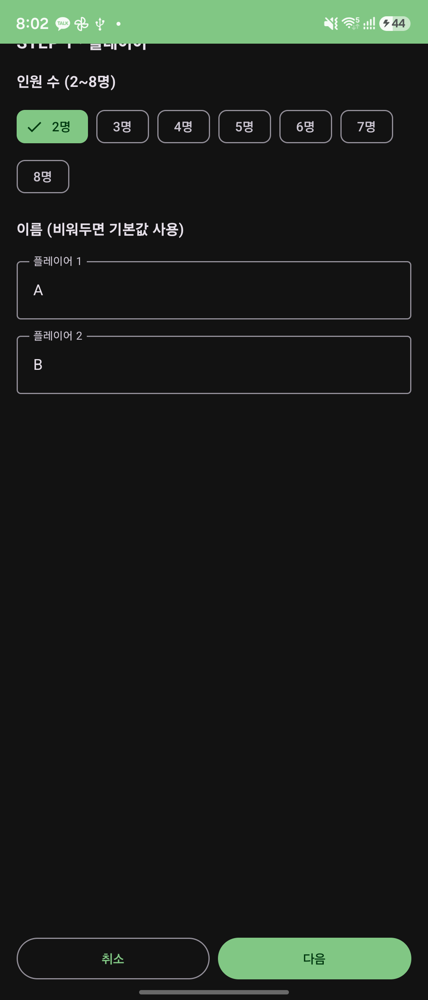
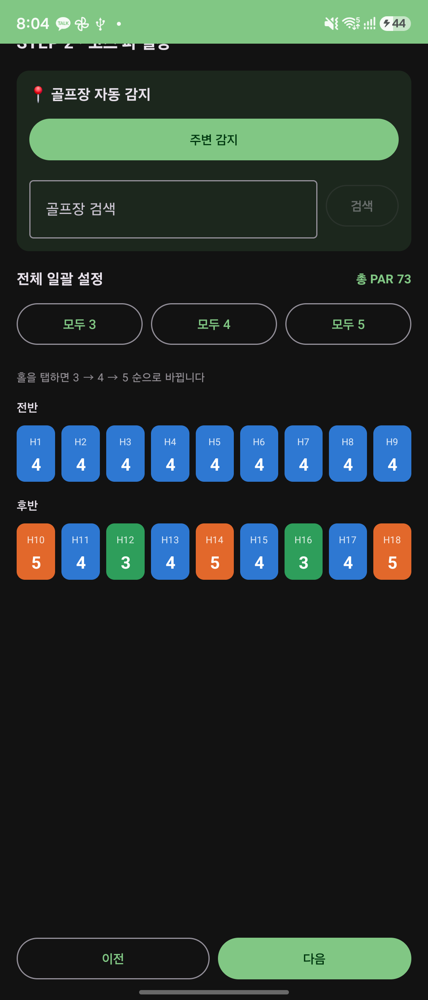
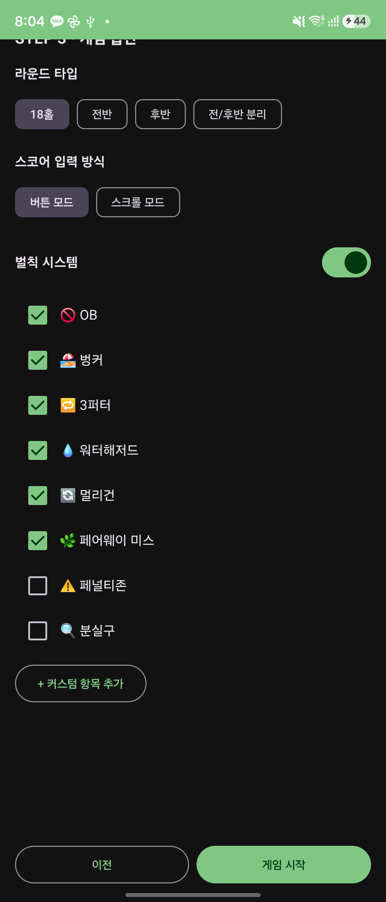
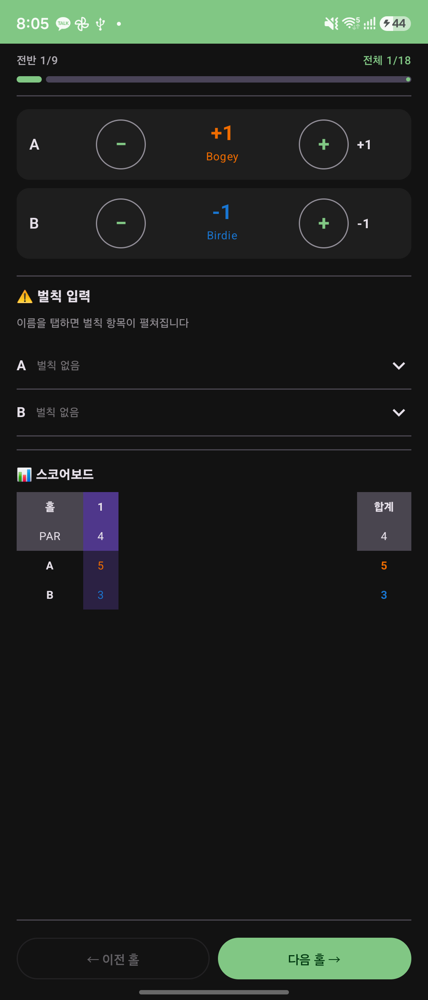
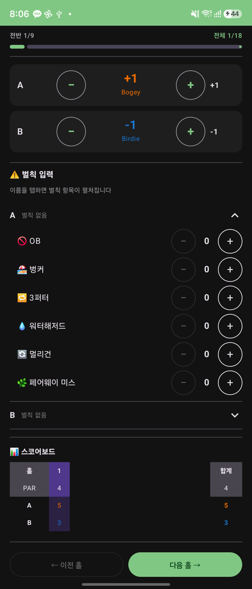
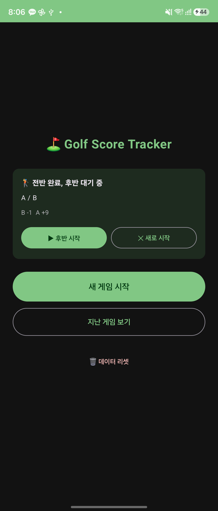
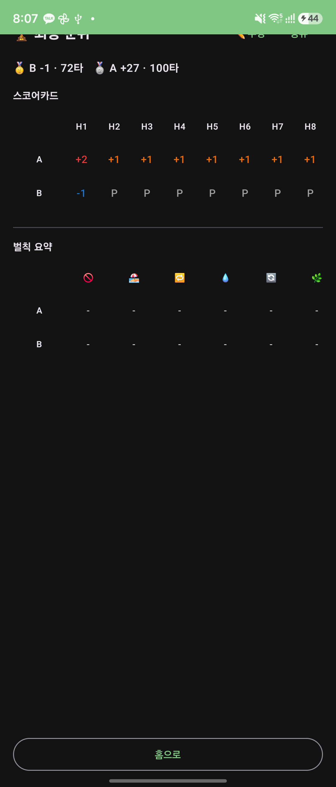

# ⛳ Golf Score Tracker (Golfsupporter)

2~8명이 함께 치는 18홀 라운드의 **스코어·벌칙·결과**를 기록하는 오프라인 우선(offline-first) 안드로이드 앱입니다. 네트워크 없이도 모든 기능이 동작하며, GPS 골프장 감지·날씨 같은 위치 기반 기능은 연결될 때만 추가로 켜집니다.

- **플랫폼**: Android (minSdk 26 / Android 8.0, target·compile SDK 34)
- **언어·UI**: Kotlin + Jetpack Compose + Material 3
- **저장**: Room(SQLite) — 전부 로컬 저장, 런타임 권한 불필요

---

## 📱 화면 미리보기

| 홈 | 플레이어 설정 | 코스 파 설정 |
|:--:|:--:|:--:|
|  |  |  |
| 새 게임·지난 게임·**데이터 리셋** | 인원 칩(선택 시 ✓+초록) · 이름 입력 | **파 3=초록·4=파랑·5=주황** 색상 구분 |

| 게임 옵션 | 라운드(스코어 입력) | 벌칙 펼침 입력 |
|:--:|:--:|:--:|
|  |  |  |
| 라운드 타입·입력 방식·벌칙 항목 | 점수 ±, **라이브 스코어보드** | **이름 탭 → 벌칙 항목 펼침** |

| 이어하기 배너 | 최종 결과 |
|:--:|:--:|
|  |  |
| 전반 완료 → 후반 대기 배너 | **오버파 + 총타수**, 스코어카드+벌칙요약 통합 |

---

## ✨ 주요 기능

### 게임 설정 (3단계 마법사)
- **플레이어**: 2~8명, 기본 이름(A/B/C…) 제공, 최근 사용 이름을 칩으로 빠르게 추가
  - 선택된 칩은 **초록 채움 + ✓**, 미선택은 외곽선 — 선택 상태가 한눈에 구분
- **코스 파**: 전반/후반 그룹, 홀을 탭하면 3 → 4 → 5 순환
  - **파별 색상 강조** (파3 초록 / 파4 파랑 / 파5 주황)으로 코스 구성을 즉시 파악
  - 📍 GPS 골프장 자동 감지 / 이름 검색으로 파 자동 로드
- **게임 옵션**: 라운드 타입(18홀·전반·후반·전/후반 분리), 스코어 입력 방식(버튼·스크롤), 벌칙 항목 on/off 및 커스텀 추가

### 라운드 진행
- 버튼 모드 `[−] 값 [+]` 또는 스크롤(드럼롤+햅틱) 모드
- 점수 자동 명칭(Eagle/Birdie/Par/Bogey…)과 색상 코딩
- **📊 라이브 스코어보드**: 입력 화면 하단에서 이전 홀별 점수 + 현재까지의 **총 샷카운트**를 표로 모니터링 (현재 홀 하이라이트, 가로 스크롤)
- **벌칙 펼침형 입력**: 플레이어 **이름을 탭하면 그 사람의 벌칙 항목이 펼쳐지고** −/+ 로 기록. 접힌 행에는 현재 벌칙 요약(🍺×2 등) 표시
- 매 홀·벌칙 변경·백그라운드 진입(onStop) 시 자동 저장
- 전반 완료 시 "후반 지금/나중" 선택 배너, 홈의 이어하기 배너로 복귀 가능

### 결과 & 편집
- **최종 순위에 오버파와 총 타수를 함께 표시** (예: `🥇 B -1 · 72타`)
- 스코어카드 합계 열은 오버파(위) + 총타수(아래) 2줄
- **스코어카드와 벌칙 요약을 탭 없이 한 화면**에 세로로 통합
- 셀 탭으로 점수·벌칙 수정(실시간 재계산, 수정 셀 강조, 편집 이력 저장), 결과 공유

### 데이터 관리
- **🗑 데이터 리셋**(홈 화면): 모든 게임·스코어·벌칙·수정이력·최근 이름을 확인 후 영구 삭제
- 지난 게임 보기: 완료된 라운드 열람 및 재편집

---

## 🆕 최근 업데이트

- 라운드 입력 화면에 **라이브 스코어보드(이전 홀 점수 + 총 샷카운트)** 추가
- 결과 화면을 **오버파 + 총타수** 동시 표기로 개선, 스코어/벌칙 **탭 → 단일 스크롤 통합**
- 파 3/4/5 **색상 강조**, 칩 선택/비선택 시각 구분 강화
- 벌칙 입력을 **플레이어별 펼침(아코디언)** UX로 전환
- 홈 화면 **데이터 리셋** 버튼 추가
- **베트남 북부 골프장 15곳**을 OpenStreetMap에서 시드 (이름 + GPS)

---

## 🏗️ 아키텍처

MVVM + 얇은 Clean Architecture, 전부 Room 기반 오프라인.

```
ui/            Jetpack Compose 화면 + ViewModel (Hilt)
  home/        이어하기 배너 · 새 게임 · 데이터 리셋
  setup/       3단계 설정 마법사
  round/       라운드 진행(점수 카드, 스코어보드, 벌칙 펼침)
  result/      결과 + 편집 모드
  navigation/  Navigation Compose 그래프
  theme/       Material 3 테마
data/
  model/       도메인 모델
  local/       Room 엔티티·DAO·컨버터·DB·기본 벌칙
  repository/  GameRepository (단일 진실 공급원) + 매퍼
  location/    LatLng(+Haversine), Fused 위치 제공자
  weather/     날씨 모델, OpenWeatherMap Retrofit API
  course/      GolfCourse, Room 캐시, CourseRepository, SampleCourses
di/            Hilt 모듈
util/          ScoreLabel, RoundRules (순수 로직, 단위 테스트)
```

### 기술 스택
- Kotlin · Jetpack Compose · Material 3
- MVVM + StateFlow · Navigation Compose
- Room(SQLite) · Hilt(DI) · KSP

---

## ⛳ 골프장 데이터

골프장 정보는 **OpenStreetMap Overpass API**(`leisure=golf_course`, 무료·키 불필요)에서 가져옵니다.

- **베트남 북부 15개 코스**(King's Island, FLC Ha Long Bay, Sky Lake, BRG Ruby Tree, Vinpearl Haiphong, Long Biên, Đại Lải 등)를 이름 + GPS로 시드 → GPS 자동감지·이름 검색에 사용
- ⚠️ OSM에는 베트남 코스의 **홀별 파 정보가 없어** 파는 설정 화면에서 수동 입력합니다
- `SampleCourses.vietnamNorth`에 정의, `CourseRepository.ensureSeeded()`가 실행 시마다 멱등 upsert
- 실시간 원격 API는 기본 stub(`StubGolfCourseApi`) — 제공자 연결 시 Hilt 바인딩만 교체

---

## ⚙️ 설정 (날씨, 선택)

날씨 표시는 OpenWeatherMap API 키가 필요합니다. `local.properties`에 추가:

```properties
OPENWEATHER_API_KEY=your_key_here
```

키가 없으면 날씨만 표시되지 않고 나머지는 정상 동작합니다.

---

## 🔧 빌드 & 실행

Android SDK와 Google Maven 접근이 필요합니다.

```bash
./gradlew assembleDebug   # 디버그 APK 빌드
./gradlew installDebug    # 연결된 기기에 설치
./gradlew test            # JVM 단위 테스트 (ScoreLabel, RoundRules, Course, Weather)
```

---

## 🗺️ 로드맵

- v1.1: 공유 옵션 확장, 스크롤 모드 민감도, 벌칙 정렬
- v2.0(2/3단계): 팀·내기 게임(스킨스/나소/스테이블포드), 랜덤 팀 구성, 정산
